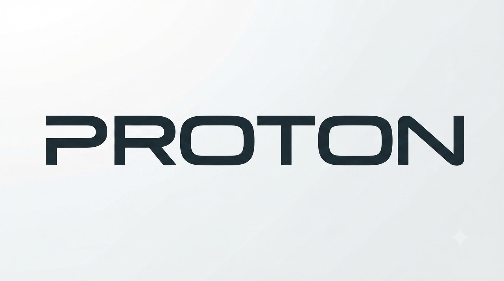

  
 

---

  <b>Mastering C programming from scratch, turning raw logic into clean code.</b>

## Introduction

**The-C-Blueprint** is my personal digital workspace and tracker. As a B.Tech CSE (AI & ML) freshman, this repository documents my journey of mastering C programming from day one!
